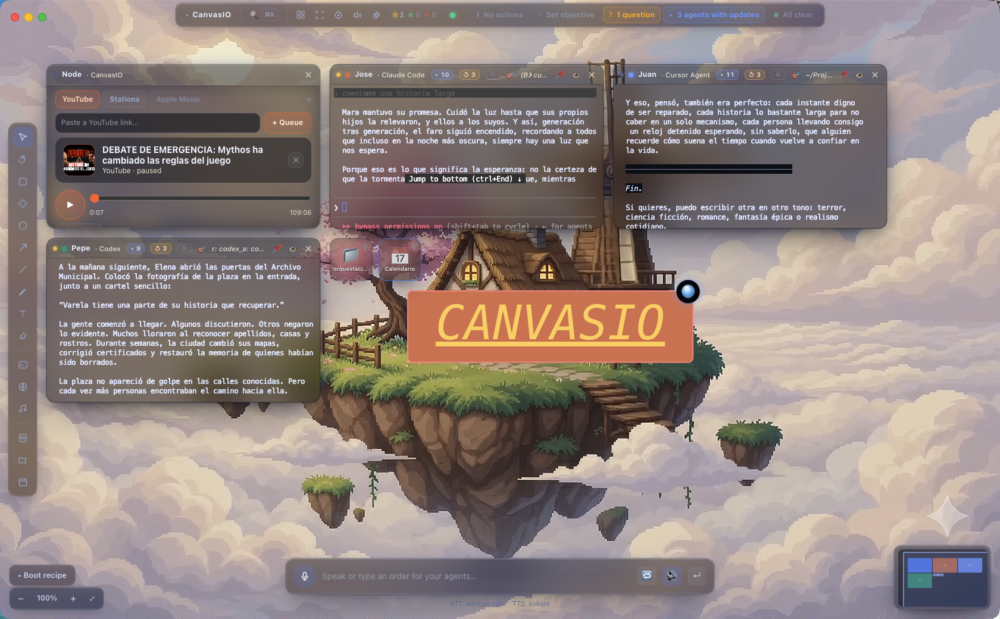

<div align="center">


# CanvasIO

**Command an army of AI coding agents from one infinite canvas — with your voice.**

   

</div>

> 🧪 **Experimental project — everyone is welcome to help!** CanvasIO is an early,
> fast-moving experiment. Ideas, bug reports and pull requests are all welcome — see
> [Contributing](#contributing) (and please skim the [PR security guide](docs/PR-SECURITY-REVIEW.md)).

CanvasIO is a **macOS** desktop app: an **infinite canvas** where you orchestrate several AI
coding agents at once (Claude Code, Codex, Cursor), each living in its own resizable
**terminal node** — driven by hands-free **voice control**, with an ambient music player,
live web previews and an animated pixel-art backdrop.



## Quick install (macOS)

Grab the latest signed build from the [**Releases**](../../releases/latest) page (download the
`.dmg`, drag CanvasIO to Applications), or install it from the terminal in one line:

```bash
# Downloads the latest CanvasIO release .dmg and installs it into /Applications
curl -fsSL https://raw.githubusercontent.com/Nachx639/canvasio/main/scripts/install.sh | bash
```

> CanvasIO is **macOS-only** (Apple Silicon recommended). It relies on macOS-native pieces
> (`node-pty`, Metal-accelerated `whisper.cpp`, the `say` voice fallback). A Windows port is
> not currently available.

## Highlights

- **Infinite canvas** with pan (trackpad / drag the background), zoom (⌘+scroll / pinch),
  a minimap and a zoom HUD.
- **Real terminal nodes** (xterm.js + node-pty) that resize with the window/node and
  actually launch `claude`, `codex`, `cursor-agent` or a `zsh` shell.
- **"Focus" music player** with a real WebAudio waveform visualizer, vibe tags
  (lofi, jazz, ambient, chill, beats, piano) and live [SomaFM](https://somafm.com) stations.
- **Web preview** (`<webview>`) with a URL bar to keep an eye on your `localhost:3000`.
- **Hands-free voice control, 100% local & low-latency**:
  - **STT** via `whisper.cpp`, Metal-accelerated on Apple Silicon (multilingual `ggml-small`).
  - **TTS** via neural **Piper**, with a guaranteed fallback to the native macOS voice (`say`).
  - Push-to-talk by holding **Space** or the mic button. Dictation goes to the selected
    agent; canvas commands ("open a claude", "close X", "play music") are spoken in your language.
- **Animated pixel-art backdrop**: night sky with moon and halo, twinkling stars, shooting
  stars, drifting clouds, swaying grass, flowers and fireflies.
- **Self-healing Doctor** (dev-only): an autonomous repair loop that diagnoses runtime
  errors, proposes fixes, gates them through CI and ships them as auto-updates.

## Languages

The interface and voice commands are available in **four languages**:

| Language | Code |
|---|---|
| English (default) | `en` |
| Español (Castellano) | `es` |
| Português | `pt` |
| 中文 (Chinese) | `zh` |

The app defaults to **English**; switch language from the Settings panel. The neural voice
models are multilingual, so dictation works across all four.

## Requirements

- macOS (tested on Apple Silicon), Node ≥ 20, `ffmpeg` (`brew install ffmpeg`).
- For the agents: have their CLIs (`claude`, `codex`, `cursor-agent`) installed on your `PATH`.

## Getting started

```bash
npm install
npm run setup:voice   # downloads whisper (STT) + Piper and the neural voice (TTS)
npm run dev           # runs the app in development mode
```

> TTS works **without** `setup:voice` thanks to the native `say` fallback.
> `setup:voice` adds STT (dictation) and the neural Piper voice.

### Packaging as a macOS app

```bash
npm run package   # ad-hoc UNSIGNED build (CanvasIO.app in dist-app/, --dir)
npm run dist      # signed + notarized dmg + zip (needs a cert + notary profile)
npm run release   # signed + notarized build that PUBLISHES the GitHub release (auto-update)
```

> `npm run package` forces `CSC_IDENTITY_AUTO_DISCOVERY=false` and uses `--dir`, so it keeps
> working without a certificate (ad-hoc signature, no notarization). This is the dev flow.

### Auto-update (electron-updater) + signing/notarization

The installed app auto-updates via **electron-updater**, reading the repository's GitHub
*releases* (the `github` provider, configured in `electron-builder.yml`). It checks for
updates on launch and roughly every 30 min; when a build is downloaded, a toast offers
"Restart to apply". In **dev** (unpackaged) the updater is a silent no-op.

A signed + notarized release (`npm run release`) needs:

1. A **"Developer ID Application"** certificate in your login keychain.
2. A **notarytool** keychain profile (created once with `xcrun notarytool store-credentials`).
3. `APPLE_TEAM_ID` set to your 10-character Team ID.
4. `GH_TOKEN` (or `GITHUB_TOKEN`) with `repo` scope to publish the release.

`electron-builder.yml` enables `mac.hardenedRuntime`, keeps the entitlements and turns on
`mac.notarize`. Targets are **dmg** (human download) + **zip** (**required by
electron-updater** on macOS).

## Shortcuts

| Action | Shortcut |
|---|---|
| Push-to-talk (dictate) | Hold **Space** or the mic button |
| Pan the canvas | Drag the background / two-finger scroll |
| Zoom | **⌘ + scroll** or pinch |
| New agent | Toolbar ▣ button → pick an agent |
| Web preview / Music | Toolbar 🌐 / ♪ buttons |

## Architecture

```
src/
  main/        Electron main process
    index.ts   window + IPC
    pty.ts     node-pty: spawn/resize/write/kill of real terminals
    voice.ts   STT (whisper.cpp) + TTS (Piper → say), model downloads
    doctor.ts  autonomous self-repair loop (dev-only)
  preload/     contextIsolation bridge (window.canvasio.*)
  renderer/    React + xterm.js + WebAudio
    components/ Canvas, NodeView, MusicPlayer, WebPreview, TopBar, Toolbar, VoiceBar, ...
    store/      zustand (nodes + camera)
    lib/        voice-command interpreter (multilingual)
```

## Design notes

- **Electron** to integrate real terminals, web previews and open-source voice models with
  no friction, and to iterate/package fast.
- **STT/TTS**: `whisper.cpp` + `Piper` were chosen for being practical-SOTA, **offline**,
  **low-latency** and multilingual.

## Contributing

**This is an experimental project and contributions of all kinds are welcome** — issues,
ideas, docs, fixes and features. New to the codebase? Open an issue to say hi or grab
anything that interests you. Pull requests are very welcome — but open-source projects are
increasingly attacked *through* their contribution workflow. **Before evaluating, approving or merging any PR, read the
[Pull Request Security Review guide](docs/PR-SECURITY-REVIEW.md) (MUST READ).** It covers
the current attack vectors (poisoned CI workflows, malicious dependencies/lockfiles,
invisible-Unicode obfuscation, Electron-specific risks) and a concrete reviewer checklist.

## Disclaimer

The optional YouTube music node can use a **user-installed** `yt-dlp` to resolve a
playable stream; if `yt-dlp` is not installed, the official YouTube embed is used
instead. Using `yt-dlp` is the **user's responsibility** and subject to the source
platform's Terms of Service. CanvasIO does not bundle or install `yt-dlp`. Trademarks
(YouTube, Apple, Cursor, Claude, Codex, etc.) belong to their respective owners and
are used here only nominatively. Audio stations are provided by [SomaFM](https://somafm.com).

## Credits

Some inspiration by **[cnvs.dev](https://cnvs.dev)** by **Mac Blade** — thanks for the spark. 🙏

## License

[MIT](LICENSE) © CanvasIO
